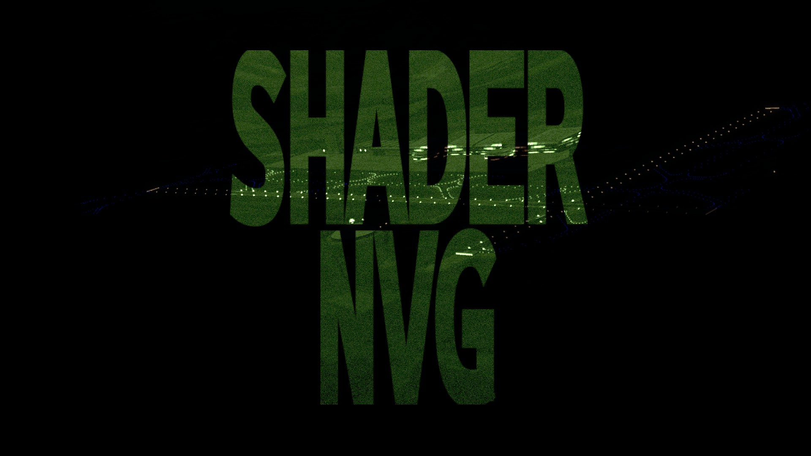
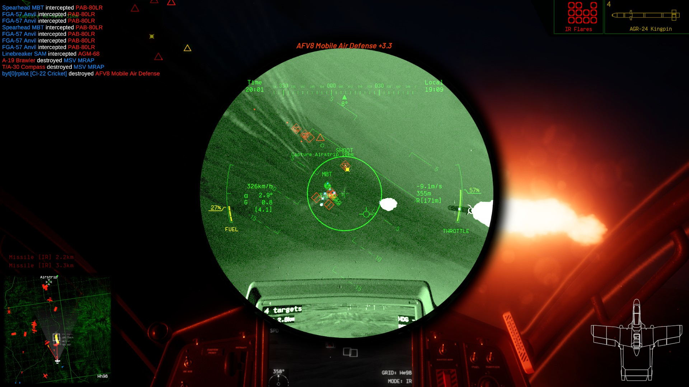
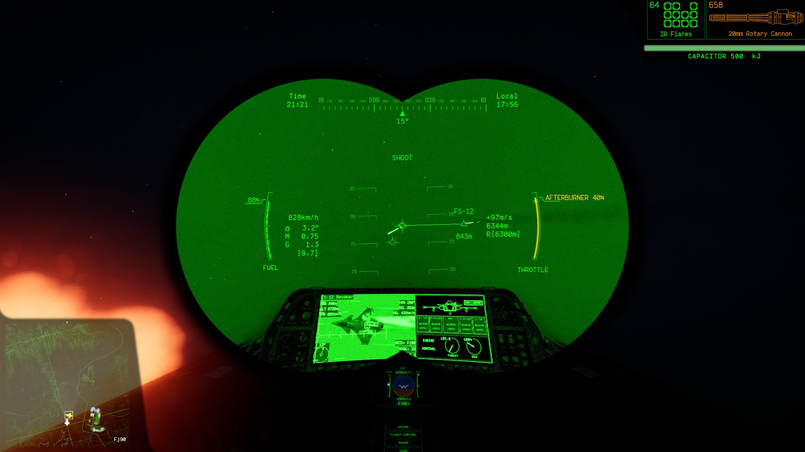
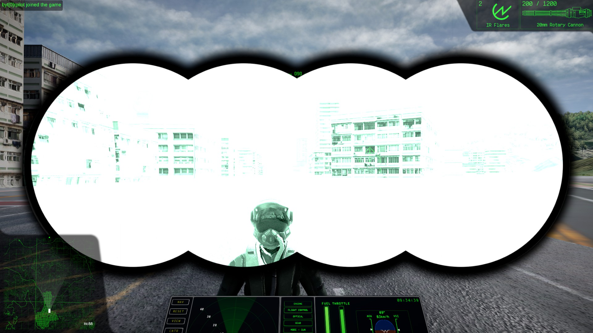
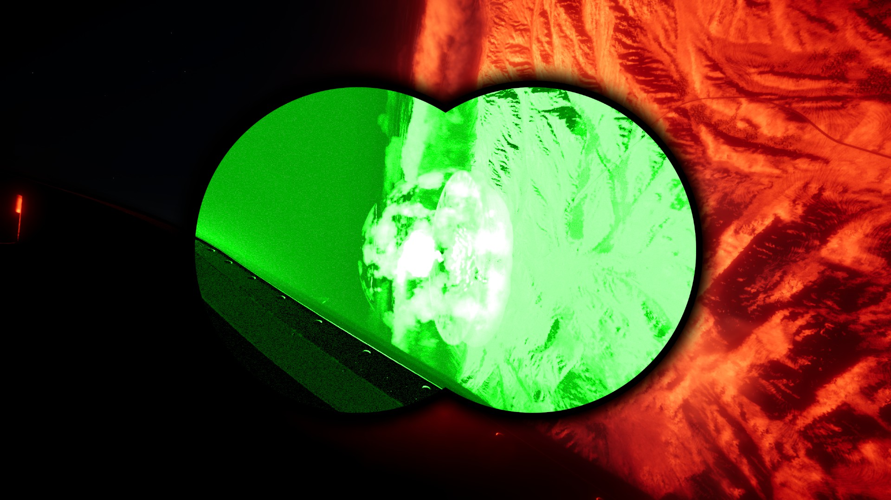

# Shader Night Vision
Replaces vanilla fullscreen night vision with custom-made masked shader night vision, with adjustable gain.

## Features
* Adjustable Gain
* Goggle Night Vision Mask (Single tube, Double tube, Quad tube and Fullscreen)
   ...And a handful of configurable options to customize the mod to your liking.

## Screenshots

# Installation
## Pre-Install Requirements
[Nuclear Option](https://store.steampowered.com/app/2168680/Nuclear_Option/) `v0.34.2`  
[BepInEx](https://github.com/BepInEx/BepInEx/releases) `v5.4+`  
[BepInEx Configuration Manager](https://github.com/BepInEx/BepInEx.ConfigurationManager/releases) `v19.0` (optional, but highly recommended if you want to configure the mod)

## Standalone BepInEx Install
1. Install [BepInEx](https://github.com/BepInEx/BepInEx/releases)
    * Follow the [Standalone BepInEx Installation Guide](https://docs.google.com/document/d/16aRWcrkt89YEn9_THwe9Fxo7AYPLE9SYSab_Y929dvE/edit?tab=t.0) if stuck/confused
2. Download the mod
3. Place the downloaded DLL file in (Your Game Folder)\BepInEx\plugins

## NOMM Install
1. Install [NOMM](https://github.com/Combat787/NOMM/releases)
2. Find the mod in the "Discover" tab by searching up "Shader Night Vision" in the search bar
3. Click the Download button on the right 

# License
This mod uses the [MIT License](LICENSE)
